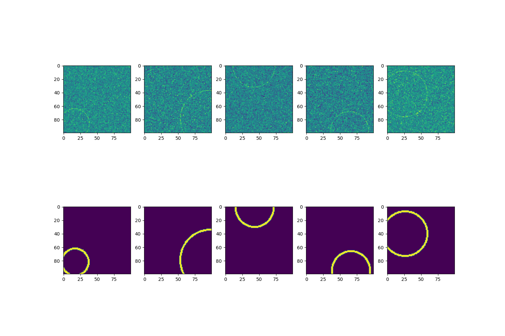

# Circle Detection

The repository conatins code for circle detection from noise images. 
A [Colab Notebook](https://github.com/TapasKumarDutta1/circle_detection/blob/main/demo.ipynb) is provided for utilizing different files and experimenting with the anomaly detection process.
The project uses shufflenet and is trained from scratch using adam optimizer and Mean Squared Error loss and iou(0.5 and 0.5-0.95) threshold accuracy as evaluation metric.

## Sample output plotted against training samples

## Things I tried that did not work
1. Pretrained models
2. Augmentation
